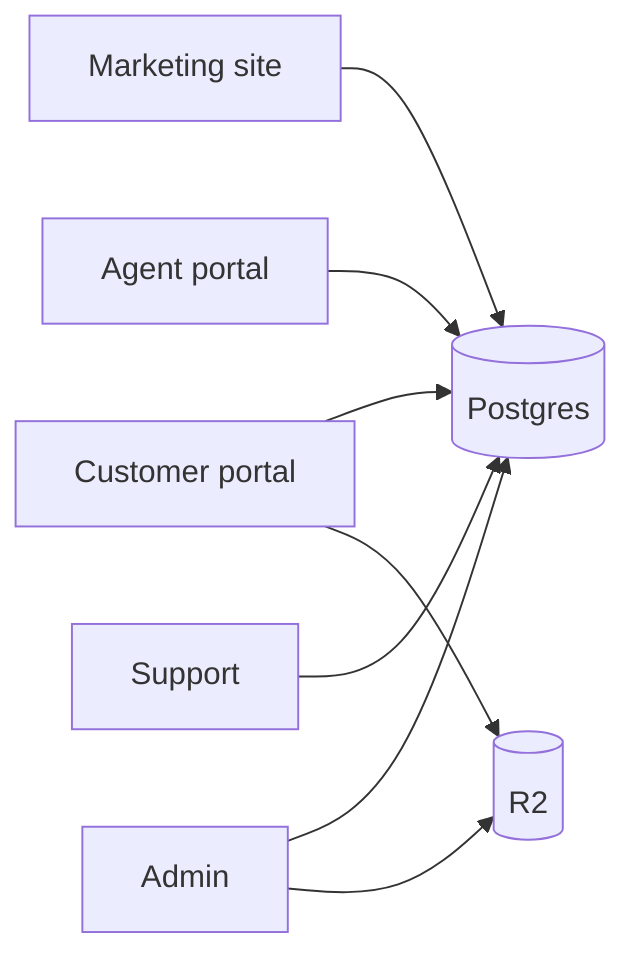

# Project handover

Welcome. This guide is the onboarding path for a human developer or AI assistant (including Claude Code) taking over PakExcise.com.

## Read docs in this order

1. **This file** — orientation  
2. [CLAUDE.md](./CLAUDE.md) — permanent engineering rules (if you are an agent)  
3. [README.md](./README.md) — install & commands  
4. [docs/ARCHITECTURE.md](./docs/ARCHITECTURE.md) — how the system fits together  
5. [docs/FEATURES.md](./docs/FEATURES.md) — what exists  
6. [docs/DATABASE.md](./docs/DATABASE.md) — Prisma / data  
7. [docs/API.md](./docs/API.md) — HTTP + server actions  
8. [docs/ENVIRONMENT.md](./docs/ENVIRONMENT.md) — env vars  
9. [docs/DEPLOYMENT.md](./docs/DEPLOYMENT.md) — staging/live  
10. [docs/PROJECT_STATUS.md](./docs/PROJECT_STATUS.md) — priorities & debt  
11. [docs/MAINTENANCE.md](./docs/MAINTENANCE.md) / [docs/TROUBLESHOOTING.md](./docs/TROUBLESHOOTING.md) — as needed  

Also skim `.cursorrules` (product constraints). Prefer **docs/** when `.cursorrules` conflicts (e.g. Guides / next-intl are gone).

## Run locally

```bash
cp .env.example .env
# Fill required values — never copy production secrets into git

pnpm install
pnpm db:setup          # or: pnpm db:push && pnpm db:seed against Neon
pnpm dev
```

Open http://localhost:3000.

Details: [README.md](./README.md), [ENVIRONMENT.md](./docs/ENVIRONMENT.md).

## Verify it works

- Homepage loads with private facilitation disclaimer  
- `/services` lists DB services (no prices)  
- `/login` reaches auth UI  
- `GET /api/health` returns ok  
- `pnpm typecheck` passes  

Optional: create a customer, start apply flow on a seeded service (needs Turnstile/SES/WhatsApp depending on env).

## Current priorities

See ordered list in [PROJECT_STATUS.md](./docs/PROJECT_STATUS.md). Short version:

1. Confirm staging/live deploys include latest English-only + Guides removal + marketing-only analytics  
2. GTM console path exceptions on live  
3. CI + foundational automated tests  
4. Align `.cursorrules` with English-only reality  
5. Clean leftover settings JSON keys in DBs if needed  

## High-risk areas

| Area | Why careful |
|------|-------------|
| `features/applications/` + status machine | Money/workflow integrity |
| `features/payments/` / `features/invoices/` | Funds & official vs facilitation fees |
| `server/security/encryption.ts` + CNIC fields | Irreversible if keys mishandled |
| `server/permissions/` | IDOR / privilege escalation |
| `server/auth/` | Session & OTP |
| `scripts/deploy-*.sh` + `prisma db push` | Can break live or drop data |
| `scripts/promote-staging-content-to-live.ts` | Overwrites live CMS |
| Impersonation actions | Super Admin power |
| Analytics / tracking | Easy to leak PII |

## Mental model



Roles share one database; authorization is enforced in **server** guards and ownership checks.

## Do / Don’t

**Do:** follow existing feature modules; validate with Zod; keep English-only; exclude fees from public UI.  

**Don’t:** reintroduce Urdu/next-intl/Guides; commit `.env`; run destructive DB commands on live without confirmation; invent APIs not in the repo.

## Getting help from the codebase

Prefer searching:

- `features/<domain>/`
- `server/repositories/`
- `config/admin.ts` for admin nav truth
- `prisma/schema.prisma` for data truth

When unsure, mark **Needs verification** and ask the owner rather than guessing.
