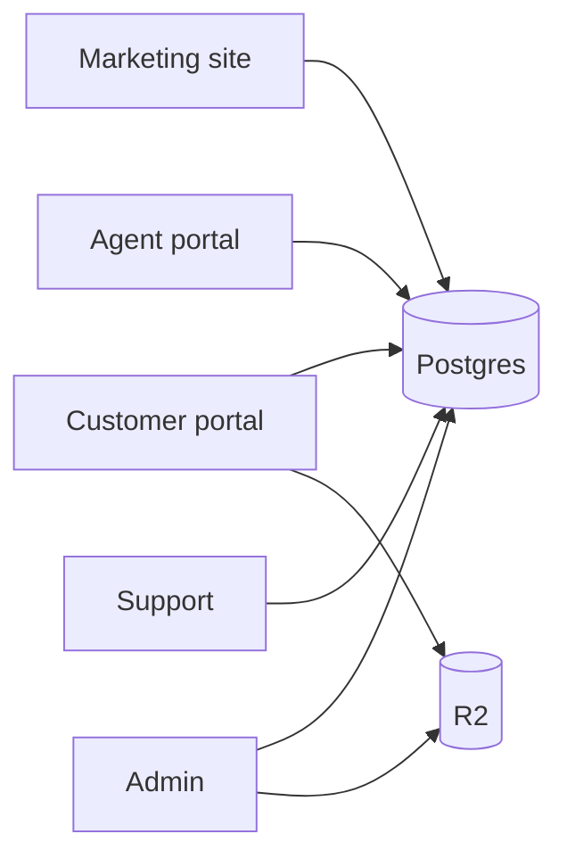

# Project handover

Welcome. Onboarding path for a human developer or AI assistant (Claude Code) taking over **PakExcise.com**.

**As of 2026-07-14:** live database matches the English-only schema (Urdu columns and Guides table removed). Prefer this docs set over outdated `.cursorrules` lines about next-intl, Urdu, or Guides.

## Read in this order

1. **This file** — orientation  
2. [docs/README.md](./docs/README.md) — documentation index  
3. [CLAUDE.md](./CLAUDE.md) — permanent agent rules (if you are an agent)  
4. [README.md](./README.md) — install & commands  
5. [docs/ARCHITECTURE.md](./docs/ARCHITECTURE.md)  
6. [docs/FEATURES.md](./docs/FEATURES.md)  
7. [docs/DATABASE.md](./docs/DATABASE.md)  
8. [docs/API.md](./docs/API.md)  
9. [docs/ENVIRONMENT.md](./docs/ENVIRONMENT.md)  
10. [docs/DEPLOYMENT.md](./docs/DEPLOYMENT.md)  
11. [docs/PROJECT_STATUS.md](./docs/PROJECT_STATUS.md)  
12. [docs/MAINTENANCE.md](./docs/MAINTENANCE.md) / [docs/TROUBLESHOOTING.md](./docs/TROUBLESHOOTING.md) as needed  

## Run locally

```bash
cp .env.example .env
# Fill required values — never commit real secrets

pnpm install
pnpm db:setup          # or: pnpm db:push && pnpm db:seed (Neon)
pnpm dev               # http://localhost:3000  (webpack)
```

Details: [README.md](./README.md), [docs/ENVIRONMENT.md](./docs/ENVIRONMENT.md).

## Verify local

- Homepage shows private facilitation disclaimer  
- `/services` lists DB services **without fees**  
- `/login` loads  
- `GET /api/health` → ok  
- `pnpm typecheck` passes  
- `/guides` redirects to `/blog` (after build/start or via next redirects)

## Verify live / staging

```bash
curl -s https://pakexcise.com/api/health
curl -s https://staging.pakexcise.com/api/health
```

Browser (hard-refresh):

| Check | Expect |
|-------|--------|
| Homepage | No “Helpful Guides” |
| Admin | No Guides nav / CRUD |
| `/guides` | → `/blog` |
| Public page Network | GTM/gtag **only if** `APP_ENV=production` |
| `/admin` Network | **No** `gtm.js` / `gtag/js` |

## Current priorities

Full list: [docs/PROJECT_STATUS.md](./docs/PROJECT_STATUS.md).

1. Live/staging smoke after cutover  
2. GTM console path exceptions (manual)  
3. Keep `.cursorrules` / docs aligned when product rules change  
4. CI + first automated tests  
5. Confirm staging SHA/buildId not lagging live  

## High-risk areas

| Area | Why |
|------|-----|
| `features/applications/` + status machine | Workflow integrity |
| `features/payments/` / `features/invoices/` | Money; official vs facilitation fees |
| `server/security/encryption.ts` | CNIC irreversibility if keys mishandled |
| `server/permissions/` | IDOR / privilege escalation |
| `server/auth/` | Sessions & OTP |
| `scripts/deploy-*.sh` + `prisma db push` | Live downtime / data loss |
| `scripts/promote-staging-content-to-live.ts` | Overwrites live CMS |
| Impersonation | Super Admin power |
| Analytics | PII leakage risk |

## Mental model



One database; **server** guards enforce role and ownership.

## Do / Don’t

**Do:** follow `features/` patterns; Zod every mutation; English only; no public fees.  

**Don’t:** restore Urdu/next-intl/Guides; commit `.env`; run `--accept-data-loss` on live without confirmation; invent APIs/tables.

## Finding truth in the repo

- Admin nav: `config/admin.ts`  
- Data model: `prisma/schema.prisma`  
- Domains: `features/<name>/`  
- Data access: `server/repositories/`  
- Proxy/auth gate: `proxy.ts`  

If unsure, write **Needs verification** and ask the owner.
