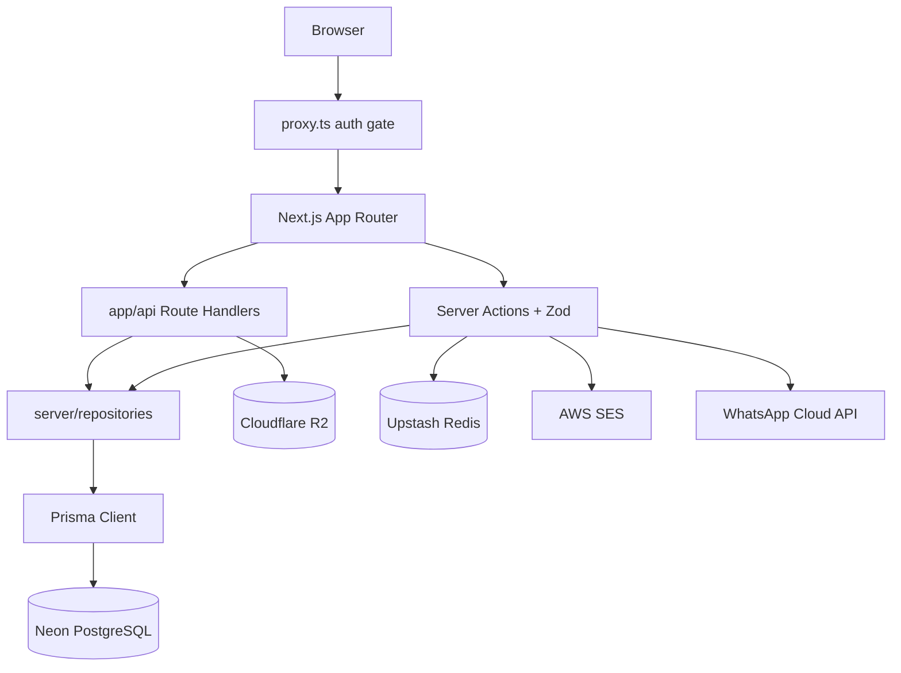
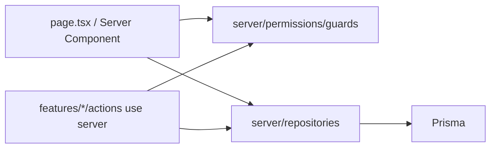
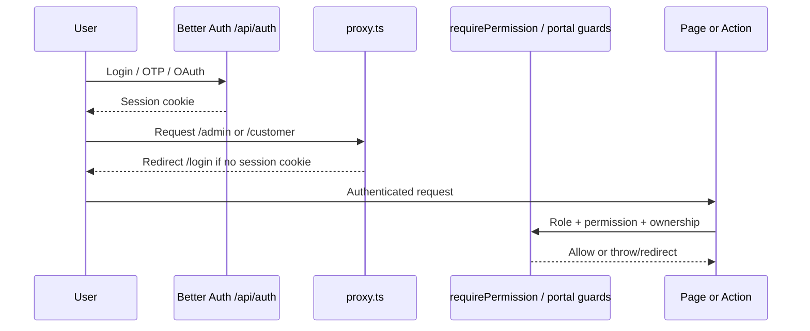
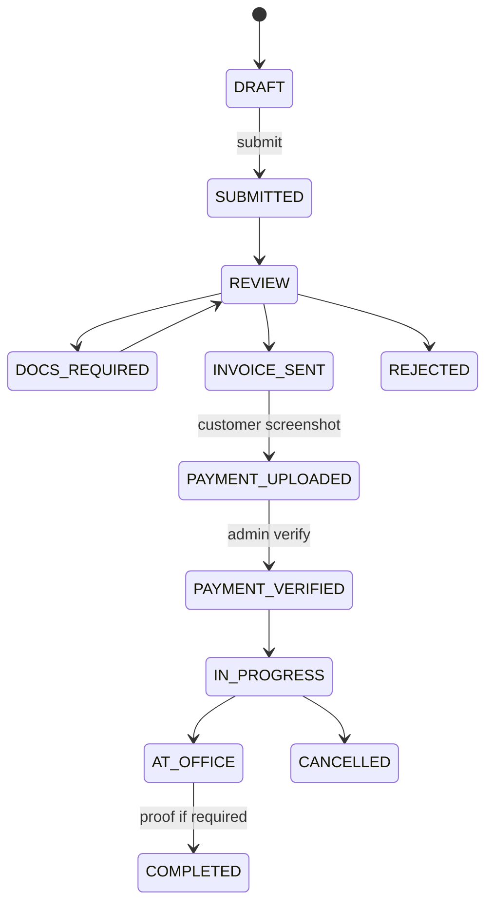

# Architecture

PakExcise.com is a **Next.js App Router** application with feature-based domains, Prisma repositories, Better Auth sessions, and portal layouts split by role.

## High-level

## Frontend architecture

- **Default:** React Server Components.
- **`"use client"`** only for interactive widgets (forms, wizards, theme toggle, analytics provider).
- **UI:** Tailwind v4 + shadcn/ui under `components/ui/`; domain UI under `components/{marketing,admin,customer,agent,support}/` and `features/*/…/components/`.
- **Copy:** English strings in `messages/en.ts`, accessed via `getTranslations` / `useTranslations` from `lib/i18n/t.ts` (not next-intl).
- **Themes:** `next-themes` (light/dark/system).
- **Route groups** (no URL segment):

| Group | URL prefix | Layout responsibility |
|-------|------------|------------------------|
| `(marketing)` | `/`, `/services`, `/blog`, … | Public chrome + `MarketingAnalytics` |
| `(customer)` | `/customer/*` | Customer shell + RBAC |
| `(agent)` | `/agent/*` | Agent shell + approved-agent checks |
| `(support)` | `/support/*` | Support shell |
| `(admin)` | `/admin/*` | Admin shell + permissions |
| `(auth)` | `/login`, `/signup`, `/auth/*` | Minimal auth chrome |
| `api/` | `/api/*` | Route handlers |

Public marketing is the **only** place GTM/GA4 scripts mount (`components/analytics/MarketingAnalytics.tsx`).

## Backend architecture

Rules (enforced by `.cursorrules` + practice):

- Business logic **not** in `page.tsx`.
- No raw Prisma in UI components.
- Domain logic in `features/*` actions/services and `server/repositories/*`.
- Zod validation on every mutation/upload/webhook-like endpoint.

## Database architecture

- **PostgreSQL** via Neon (production/staging) or Docker locally.
- **Prisma schema:** `prisma/schema.prisma`.
- Soft delete (`deletedAt`) on selected models (`User`, `Region`, `City`, `Service`, some plate formats).
- Sensitive fields: `User.cnicEncrypted` / `cnicHash`; `ApplicationFieldValue.valueEncrypted` + `isEncrypted`.
- Append-only style histories: `StatusHistory`, `AuditLog`.

See [DATABASE.md](./DATABASE.md).

## Authentication and authorization

- **Library:** Better Auth (`server/auth/config.ts`), handler `app/api/auth/[...all]/route.ts`.
- **Roles (DB enum):** `CUSTOMER`, `AGENT`, `SUPPORT`, `ADMIN`, `SUPER_ADMIN`. Unauthenticated users behave as guests.
- **Permissions:** `server/permissions/roles.ts` (e.g. `application:read`, `payment:verify`, `content:manage`).
- **Guards:** `server/permissions/guards.ts` (`requireUser`, `requirePermission`, `requireSuperAdmin`, `assertApplicationOwnership`, …).
- **Edge/proxy:** `proxy.ts` cookie presence check for `/admin`, `/customer`, `/agent`, `/support` (server still enforces RBAC).
- **Admin 2FA:** `ADMIN` / `SUPER_ADMIN` roles requiring two-factor assert when enabled.

## External integrations

| Integration | Usage | Entry points |
|-------------|--------|--------------|
| Cloudflare R2 | Private uploads, signed URLs | `server/r2/*`, `/api/upload/presign`, document/payment upload routes |
| Upstash Redis | Rate limiting, queues hooks | `server/security/rate-limit.ts`, realtime valkey driver (optional) |
| AWS SES | Transactional email | Notification delivery paths |
| WhatsApp Cloud API | OTP + notifications | Auth / notification modules |
| Turnstile | Public form bot protection | Contact / guest forms — Needs verification of every form |
| Sentry | Error monitoring | `sentry.*.config.ts`, Next webpack plugin |
| GA4 / GTM / Meta / TikTok | Marketing pixels | Production only; marketing layout |

## Important design patterns

1. **Feature modules** under `features/<domain>/` (actions, admin UI, lib).
2. **Repository pattern** under `server/repositories/` with `publicServiceSelect` omitting fees.
3. **Status machine** for applications: `features/applications/status-machine.ts`.
4. **Invoice as sole fee surface** — no public pricing cards.
5. **Presigned upload** then confirm actions; never expose private R2 keys.
6. **Activity events** with PII sanitization: `features/tracking/*`, `features/analytics/*`.
7. **English-only i18n** after bilingual cleanup; legacy locale URL redirects remain.

## Application data flow (submit → complete)

Every transition records `StatusHistory` with a note. `COMPLETED` may require proof when `service.requiresProof` is true.

## Directory and module responsibilities

| Path | Responsibility |
|------|----------------|
| `app/` | Routes, layouts, `sitemap.ts`, `robots.ts`, API |
| `components/` | Reusable UI and shells |
| `features/` | Domain use-cases and server actions |
| `server/auth/` | Better Auth config and sessions |
| `server/permissions/` | RBAC |
| `server/repositories/` | Data access |
| `server/security/` | Encryption, headers, rate limits |
| `server/r2/` | Object storage |
| `server/realtime/` | SSE / polling publishers |
| `lib/` | Shared utils, validations, analytics helpers |
| `config/` | Static config (auth paths, admin nav, env schema) |
| `prisma/` | Schema + seeds |
| `messages/` | English UI catalog |
| `scripts/` | Deploy, env sync, content promote |
| `proxy.ts` | Request proxy (locale redirects + cookie gate) |
| `.cursorrules` | Updated for English-only; prefer `docs/` if conflict |

## Related docs

- [FEATURES.md](./FEATURES.md)
- [DATABASE.md](./DATABASE.md)
- [API.md](./API.md)
- [DEPLOYMENT.md](./DEPLOYMENT.md)
